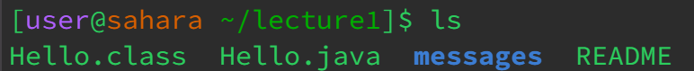
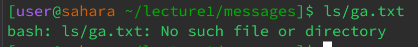
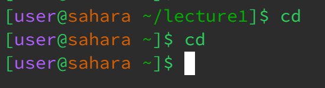
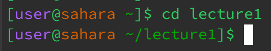
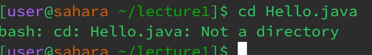
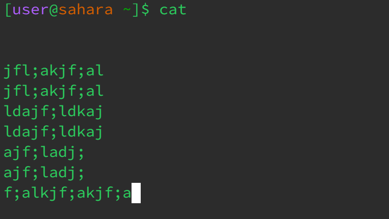
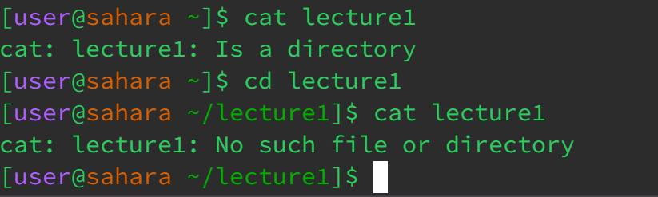

## **These are my screenshots**

ls outside of a directory with no arguments lists folders/directories in my workspace

ls with the directory as the argument lists the available files  

ls with the file as the argument says that it isn't a file or repository

cd outside of a directory with no arguments "/home" does nothing 
cd in a directory with no arguments takes me out of the directory

cd with an argument of folder/directory takes me to a directory

cd with an argument file tells me that it's not a directory 

cat with no arguments returns a nothing as we are in no directory but allows for us to write in the terminal output
(also found out that pressing Ctrl and C takes you out of the cat)

cat with an argument of a folder/directory will state that it's a folder/directory and cat doesn't print the names of folders/directories 

cat with an argument of a file will state the contents in the file (But must be in the right directory with the right file to do so)

