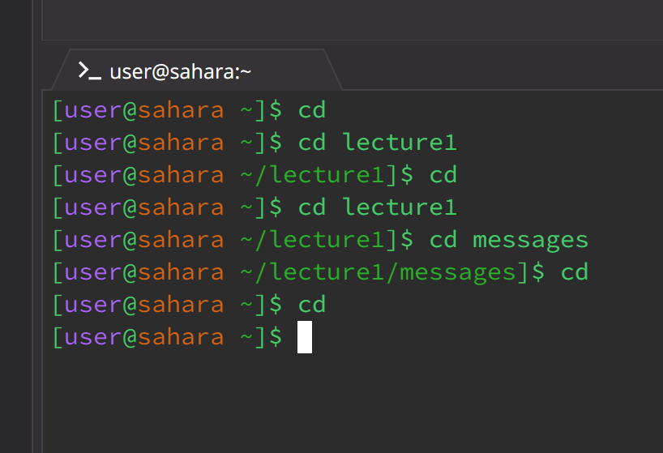

## **These are my screenshots**

1. The `ls` command lists the `lecture1` directory. The current directory was `home` directory and there wasn't any paths to the command.
2. The output of the directory was `Lecture1` which is the contents of what is inside of the workspace directory `home`. Because we didn't
    use a path or didn't change what directory we are in then this is the output.
3. `ls` outside of a directory when used with no argument/paths, lists the files and directories in the current working directory.

1. The `ls` in the folder `Lecture1` lists `Hello.java`, `Hello.class`, `Messages`, and `README`
2. The output was not an error as it listed out what was inside the directory `Hello.java`, `Hello.class`, `Messages`, and `README`. If You
   place a folder like a `/path` it will give an error `no such file or directory`
3. `ls` with a directory as the argument lists the files and directories within that specified directory.
   

1. Now going to use the `ls` with a path of `ga.txt`.
2. `ls` with a path of the file `ga.txt` gave me an error stating that it is not a directory/folder
3. `ls` with the file as the path says that it isn't a file or repository. 
   Basically saying that it returns an error message stating that the specified file is not a directory.
   

1. Using `cd` with no arguments/paths at the `home` directory.
2. The output was not an error as nothing happens when at a home directory or returning to the home directory if in one. 
3. Cd outside of a directory with no arguments/paths `/home` does nothing 
   `cd` in a directory with no arguments/paths takes me out of the directory straight home.

1. `Cd` with the path `lecture1` of folder/directory takes me to a directory.
2. The output of this is not an error, given as the command took me to the directory `lecture1`.
3. `Cd` with a folder as the path will change the current directory to the folder.

                             

1. `Cd` with the path of the file `Hello.java`.
2. The output of the command causes an error stating that it is not a directory/folder as it is only allowed to cd
   into directories.
3. `Cd` with the path of a file tells me that it's not a directory because the file is not a parent.

1. I wrote the command `cat` with no arguments/paths in the `home` directory.
2. The output was not an error and we were able to write in the terminal as nothing happened. 
3. `Cat` with no arguments returns a nothing as we are in no directory but allows us to write in the terminal output.
   (also found out that pressing `Ctrl` and `C` takes you out of the cat).

1. I used the `cat` command with the argument/path `lecture1`. 
2. `cat` with an argument folder/directory does give me an error and will state that it's a folder/directory. `cat` doesn't print the name `'lecture1'`.
3. The `cat` command is used to concatenate and display the content of files and it doesn't work on directories.

1. I used the `cat` command on the `en-us.txt` file to display its contents.
2. The output doesn't give me an error instead it displays the words "Hello World!", the contents of such file.
3.` cat` with an argument of a file will state the contents in the file (But must be in the right directory with the right file to do so).

