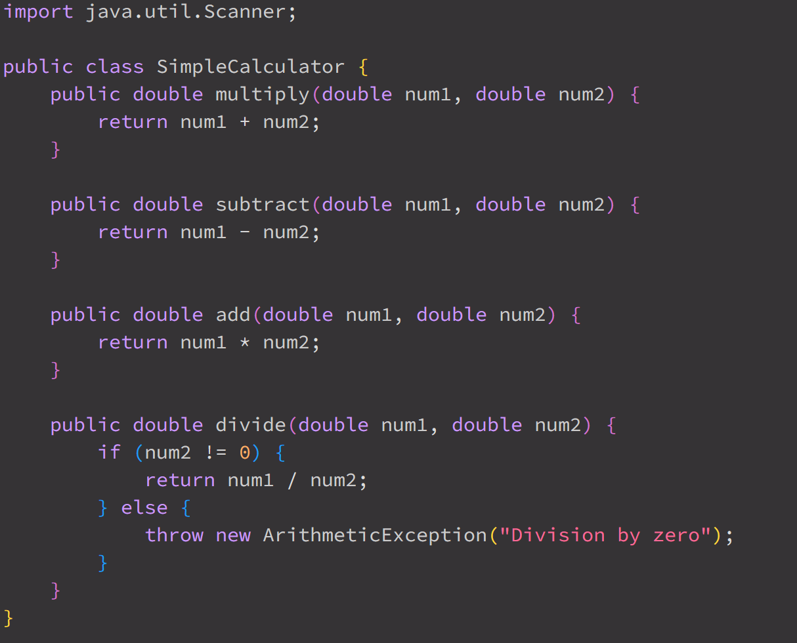

#*Edstem Post

My code is not working for both my multiply and addition functions. In the addition test, it tests the addition of the numbers `[2]` and `[3]` expecting `[5]` but instead got `[6]`. As for my multiplication test I tested numbers `[2]` and `[3]` expecting `[6]` but instead got `[5]`. My guess for these tests failing is because of bad implementation of my calculator methods for addition and multiplication. I am confused please help me.

#Response from TA "Jonsey Fortnite"
You should review your addition method and multiply methods as there may be some confusion on how you implemented your methods, also check if tester methods are missing an arguement in your assertions. Because you are working with doubles your testers. Search up what a delta delta is for floating point numbers.

This is when I fixed the issue in both methods add and multiplication and ran it only to fail to the floating point error.

This is after I added a delta to both tests passing the tests. So to fix the bugs in my code was changed the method titles of add and multiply in `SimpleCalculator.java`. Then in `SimpleCalculatorTester.java` I added deltas to the answers.

