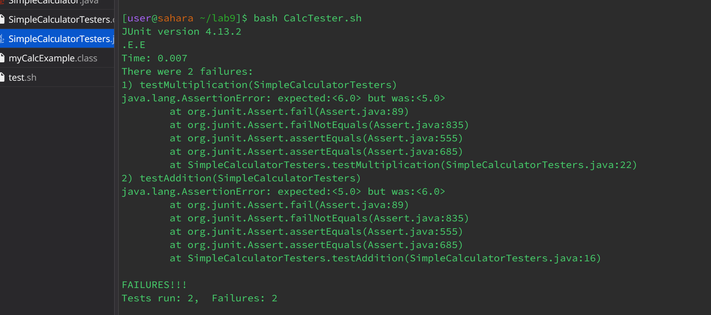
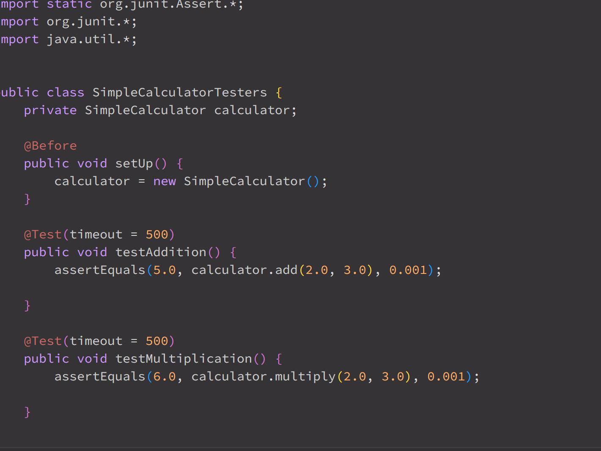

#*Edstem Post

My code is not working for both my multiply and addition functions. In the addition test, it tests the addition of the numbers `[2]` and `[3]` expecting `[5]` but instead got `[6]`. As for my multiplication test I tested numbers `[2]` and `[3]` expecting `[6]` but instead got `[5]`. My guess for these tests failing is because of bad implementation of my calculator methods for addition and multiplication. I am confused please help me.
