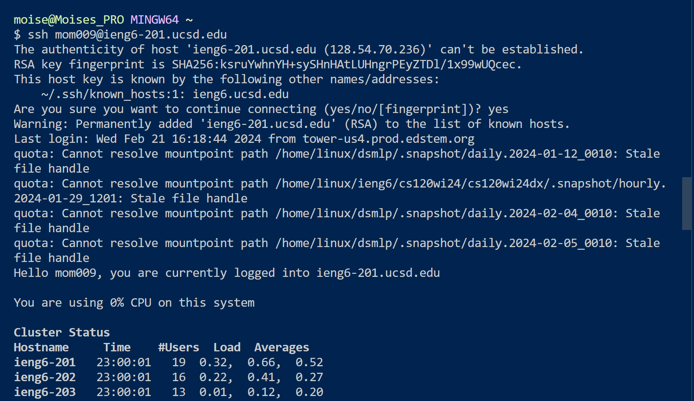
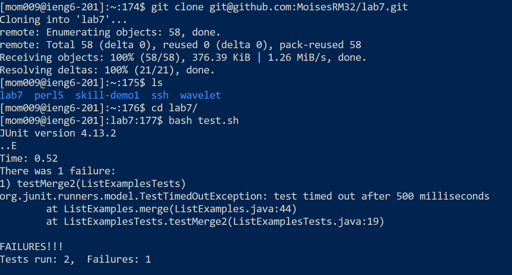
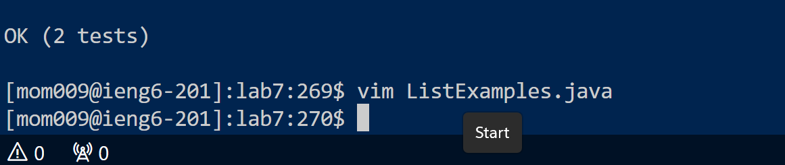
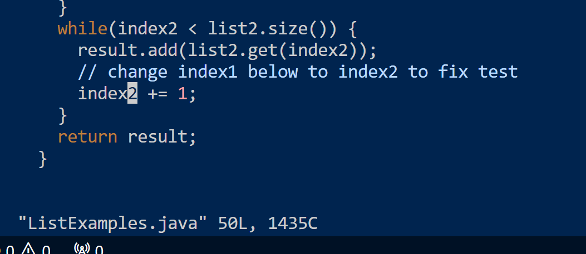
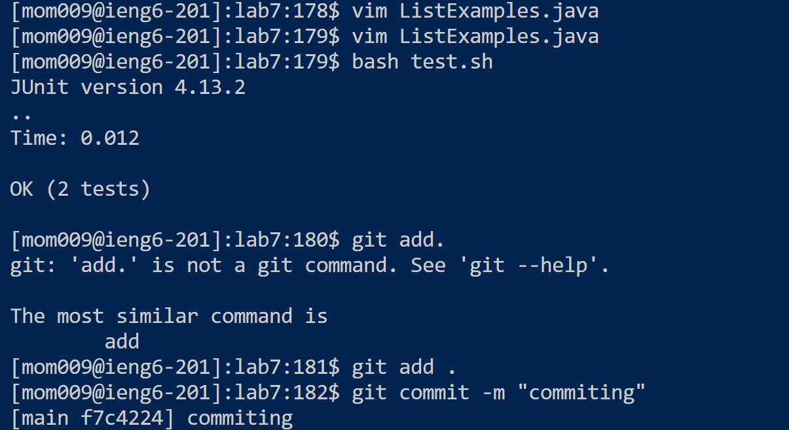
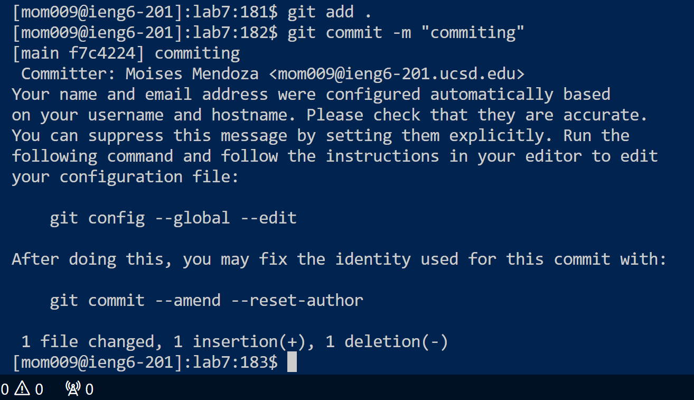
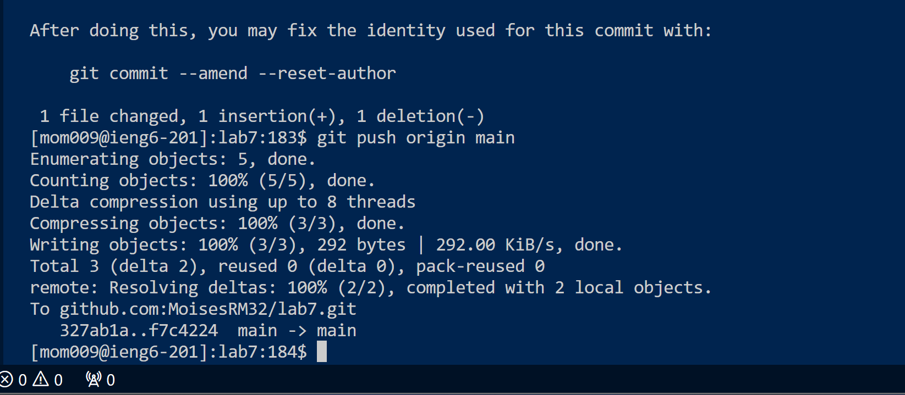

Keys pressed(note that I have typed out to get in the server); (`ssh`,`<space>`,`mom009@ieng6-201.ucsd.edu `,`<enter>`). Allowed me to go into the server ieng6-201.

Keys pressed (note that I have copied and pasted the link into git clone); (`git`, `<space>`, `clone`, `<space>`,`<Ctrl>`,`<V>`,`git@github.com:MoisesRM32/lab7.git`, `<enter>`). Allows me to clone the ssh of lab7 into my ieng6 student directory. 
 
Keys pressed(`cd`, `<space>`, `lab7`, `<enter>`),(`bash`, `<space>`, `test.sh`, `enter`). In order to test the code I cd into the lab7 directory and then I ran the bash test.sh script. Allowing me to run the failed tests.

Keys pressed(`vim`,`<space>`,`ListExamples.java`). This allows me to enter vim on ListExamples to be able to change the errors that need to be fixed. 

Keys pressed(`43J`,`11L`,`x`,`i`,`2`,`<Esc>`,`:wq`). this allowed me to go to the specific line then to the specific number change 1 to 2, then pressing ESC, then exiting with save and quit.

Keys pressed(`<up>`,`<up>`,`<enter>`) Reran the test giving me passed tests now that we fixed the error.

Keys pressed(`git`, `<space>`, `add`, `<space>`, `.`, `<enter>`) adds the changes to our version of our code

Keys pressed (`git`, `<space>`, `commit`, `<space>`, `-m`, `<space>`, `"commiting"` ,`<enter>`) this saves the current state of the files

keys pressed (`git`,`<space>`, `push`,`<space>`, `origin`,`<space>`, `main`,`<enter>`) this allows me to push the file to git main branch
