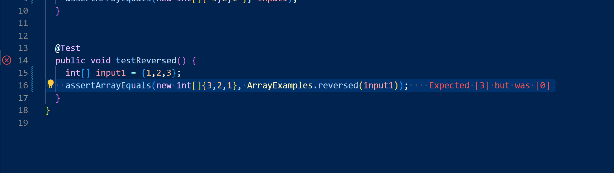
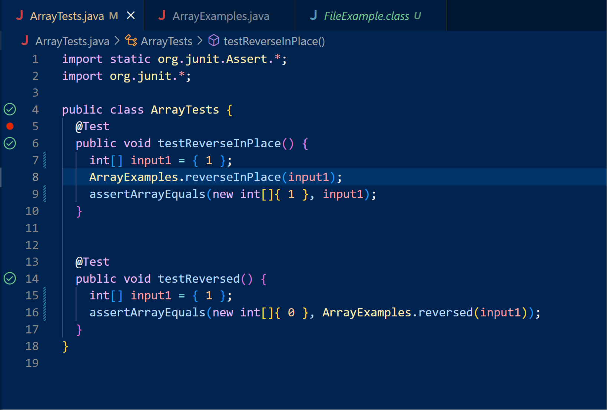

# Failure-inducing test that is supposed to create a new array with the same elements in reversed order as expected but doesn't

```
  @Test
  public void testReversed() {
    int[] input1 = { 1,2,3 };
    assertArrayEquals(new int[]{ 3,2,1 }, ArrayExamples.reversed(input1));
  }
}

```
# Working test that passes but doesn't give the right output we want
```
public class ArrayTests {

  @Test
  public void testReversed() {
    int[] input1 = { };
    assertArrayEquals(new int[]{ }, ArrayExamples.reversed(input1));
  }
}

```

# This test also fails because the expected new array doesn't match our actual array


# This shows the tests passing but are not giving the output we want



# Here is the before-the-bug fix (doesn't work because it was updating the wrong arr)
```
  static int[] reversed(int[] arr) {
    int[] newArray = new int[arr.length];
    for(int i = 0; i < arr.length; i += 1) {
      arr[i] = arr[arr.length - i - 1];
    }
    return arr;
  }
```
# Here is the after-the-bug fix (changing the arr to update to newArray)
```
  static int[] reversed(int[] arr) {
    int[] newArray = new int[arr.length];
    for(int i = 0; i < arr.length; i += 1) {
      newArray[i] = arr[arr.length - i - 1];
    }
    return newArray;
  }
```

# find /path/to/search -type f Finding files by Type by using `find /docsearch/technical -type f`, searching regular #files but using `find /docsearch/technical -type d`, searching for directories 

```
moise@Moises_PRO MINGW64 ~/docsearch/technical (main)
$ cd C:/Users/moise/docsearch/technical
find . -type f
```
# Output
```
./plos/pmed.0020273.txt
./plos/pmed.0020274.txt
./plos/pmed.0020275.txt
./plos/pmed.0020278.txt
./plos/pmed.0020281.txt
etc...
```
.
.
.
```
moise@Moises_PRO MINGW64 ~/docsearch/technical (main)
$ cd C:/Users/moise/docsearch/technical
find . -type d
```
# Output
```
./911report
./biomed
./government
./government/About_LSC
./government/Alcohol_Problems
./government/Env_Prot_Agen
./government/Gen_Account_Office
./government/Media
./government/Post_Rate_Comm
./plos
```
The first one lists all of the files in `./technical` using the find command with the `type f` and then in the next one I used the same command but instead used the `type d` for directories listing all of the directories in `./technical`
.
.
.
# find the file by searching for the file name and then riding the paths and file type just returning the name `find /path/to/search -name "filename" -printf "%f\n"` 

```
$ find C:/Users/moise/docsearch/technical -name "pmed.0020236.txt" -printf "%f\n"
```
# output
```
pmed.0020236.txt
```
.
.
.
```
moise@Moises_PRO MINGW64 ~/docsearch/technical (main)
$ find C:/Users/moise/docsearch/technical -type d -name "government" -printf "%f\n"
```
# output
```
government
```
This will search for a file named `pmed.0020236.txt` within the `./technical` when looking for the specific file name. The second one will search for the directory name in the `./technical` in this case looking for the `government` directory.
.
.
.
# You can search for files that have been modified within a specific timeframe using the -mtime option. 
```
find C:/Users/moise/docsearch/technical -type f -mtime -7
```
# Output
```
C:/Users/moise/docsearch/technical/government/Media/Assuring_Underprivileged.txt
C:/Users/moise/docsearch/technical/government/Media/Attorney_gives_his_time.txt
C:/Users/moise/docsearch/technical/government/Media/Avoids_Budget_Cut.txt
C:/Users/moise/docsearch/technical/government/Media/A_helping_hand.txt
C:/Users/moise/docsearch/technical/government/Media/A_Perk_of_Age.txt
etc..
```
.
.
.
```
moise@Moises_PRO MINGW64 ~/docsearch/technical (main)
$ find C:/Users/moise/docsearch/technical -type f -mmin -60
```
# Output doesn't return anything because no files were edited in the past 60 seconds
.
.
.
The `find` command: `find C:/Users/moise/docsearch/technical -type f -mtime -7`
will find files modified within the last 7 days in `./technical`. You can also use +7 for files modified more than 7 days ago, or 7 for exactly 7 days ago. In the second one I used  `find C:/Users/moise/docsearch/technical -type f -mmin -60` searching for files edited in the past hour or 60 mins  
.
.
.
# You can search for empty files and directories using the -empty option.
```
find C:/Users/moise/docsearch/technical -type f -empty
```
# Output
```
moise@Moises_PRO MINGW64 ~/docsearch/technical (main)
$ find C:/Users/moise/docsearch/technical -type f -empty
C:/Users/moise/docsearch/technical/all-files.txt
C:/Users/moise/docsearch/technical/find-results.txt
```
.
.
.
```
moise@Moises_PRO MINGW64 ~/docsearch/technical (main)
$ find C:/Users/moise/docsearch/technical -type d -empty
```
# Output is nothing because there are no empty directories in `./technical

The `find -empty` command found the empty files in `./technical` (`find C:/Users/moise/docsearch/technical -type f -empty`) and `find C:/Users/moise/docsearch/technical -type d -empty` found all the empty directories in `./technical`. This will find empty files in the specified directory. You can also search for empty directories by omitting -type f.
.
.
# Found all my information about the different command line uses from Chat GBT

