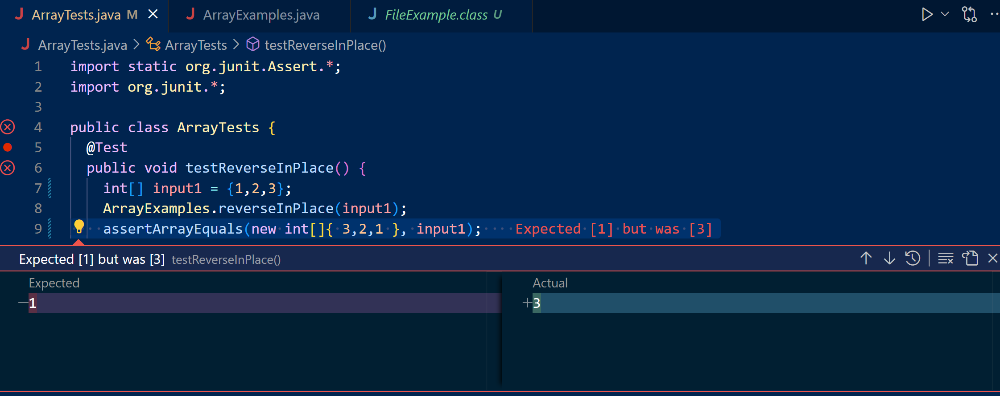

# Failure-inducing test as the expected reversed array does not equal our actual array
```
public class ArrayTests {
	@Test 
	public void testReverseInPlace() {
    int[] input1 = {3,2,1};
    ArrayExamples.reverseInPlace(input1);
    assertArrayEquals(new int[]{3,2,1} input1);
	}
```
# Failure-inducing test that is supposed to create a new array with the same elements in reversed order as expected but doesn't

```
  @Test
  public void testReversed() {
    int[] input1 = { 1 };
    assertArrayEquals(new int[]{ 1 }, ArrayExamples.reversed(input1));
  }
}

```
# Working tests that pass but don't give the right outputs we want
```
public class ArrayTests {
	@Test 
	public void testReverseInPlace() {
    int[] input1 = { 1 };
    ArrayExamples.reverseInPlace(input1);
    assertArrayEquals(new int[]{ 0 } input1);
	}

  @Test
  public void testReversed() {
    int[] input1 = { };
    assertArrayEquals(new int[]{ }, ArrayExamples.reversed(input1));
  }
}

```
# The test failed as the excepted array doesn't match our original array


# This test also fails because the expected new array doesn't match our actual array


# This shows the tests passing but are not giving the output we want

